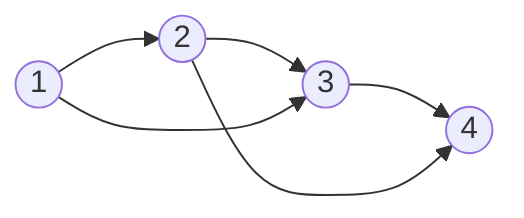

# Discussion 0319

## 1 Directed temporal graph with skip-connection

### 1.1 Mathematics

Define the effects of time step $i$ on time $j$ is **global and uniform**: $a_{j-i}$, max connection interval $t_0$

Example: $t_0=2$, adjacency matrix $\mathbf{W}^d(t_0=2)=\begin{bmatrix}0\\a_1 & 0\\a_2 &a_1&0\\ &a_2 & a_1 & 0\\& & \ddots&\ddots&\ddots \\ & & & a_2 & a_1& 0\end{bmatrix}$, thus
$$
\mathbf{W}^d= \sum_{k=1}^{t_0} a_k\mathbf{J}^k, \text{where }\mathbf{J}=\begin{bmatrix}0\\
1& 0\\
& 1&0\\
&& \ddots&\ddots\\
&&& 1 & 0\end{bmatrix}
$$
(lower-triangle Jordan normal form matrix), normalized Laplacians
$$
\mathbf{L}^d_r=\mathbf{I}-\mathbf{D}^{-1}\mathbf{W}^d, l_{ij}^r =\left\{
\begin{aligned}
	\frac{a_{i-j}}{\sum_{k=1}^{i} a_k}, i\le t_0\\
	\frac{a_{i-j}}{\sum_{k=1}^{t_0} a_k}, i>t_0
\end{aligned}
\right.
\\
[\mathbf{L}^d_r \mathbf{x}]_i = x_i - \frac{\sum_{k=1}^{\min(t_0, i)}a_k x_{i-k}}{\sum_{k=1}^{\min(t_0, i)}a_k}\\
[(\mathbf{L}^d_r)^\top \mathbf{x}]_i = x_i - \sum_{k=1}^{\min(t_0, T-1-i)}\frac{a_k x_{i+k}}{\sum_{l=1}^{\min(t_0, i+k)} a_l}
$$

### 1.2 Implementation

#### 1.2.1 Edge weights and Connection list

- Edge weights: All 1, normalized

  Matrix `(T, N, t_0)`, $w_{ijk}$ denotes weights of $e(j_{(t=i-k)},j_{(t=i)})$

  > Explanations: column $k$ in dimension -1 denotes the connections to its $k$-hop history

  In the form of a lower-triangle matrix with diagonals all 0

  normalized with row-sum equal to 1

- Connection list: Matrix `(T, t_0)`

  in the form $\begin{bmatrix}*\\ 0& *\\1 & 0 & *\\ 2 & 1 & 0 & *\\\vdots & \ddots &\ddots &\ddots &\ddots\\ t_0-2&\cdots&2&1&0&* \\t_0-1 & t_0-2&\cdots&2&1&0\\\vdots &\vdots &\ddots &\vdots&\vdots&\vdots\\T-2 & T-1&\cdots & T-t_0-3 & T- t_0-2 & T-t_0-1\end{bmatrix}$

  $M_{ij}$ denotes nodes in time $i$'s $j$-hop history, which is time $i-j$

#### 1.2.2 Operations

`x (B, T, N, C), d_ew (T, N, t_0), time_list (T, t_0)`

- `apply_op_Ldr` ($\mathbf{L}^d_r\mathbf{x}$): 

## 2 Experiments

### 2.1 Normalization of node signals

Standardization:
$$
\hat{x}=\frac{x-\text{mean}(\bold{x})}{\text{std}(\bold x)}
$$
Normalization
$$
\hat{x}=\frac{x-\text{mean}(\bold{x})}{\text{std}(\bold x)}
$$
 

### 2.2 Each regularized term of Eq. (5)

### 2.3 Error with ground-truth

### 2.4 Increasing $\rho$s

### 2.5 Skip-connection directed graphs

