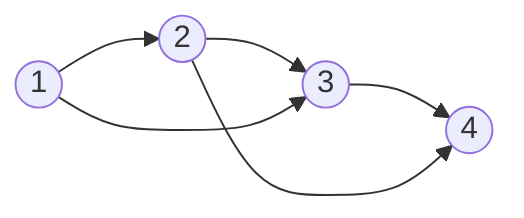

# Discussion 0319

## 1 Directed temporal graph with skip-connection

### 1.1 Mathematics

Define the effects of time step $i$ on time $j$ is **global and uniform**: $a_{j-i}$, max connection interval $t_0$

Example: $t_0=2$, adjacency matrix $\mathbf{W}^d(t_0=2)=\begin{bmatrix}0\\a_1 & 0\\a_2 &a_1&0\\ &a_2 & a_1 & 0\\& & \ddots&\ddots&\ddots \\ & & & a_2 & a_1& 0\end{bmatrix}$, thus
$$
\mathbf{W}^d= \sum_{k=1}^{t_0} a_k\mathbf{J}^k, \text{where }\mathbf{J}=\begin{bmatrix}0\\
1& 0\\
& 1&0\\
&& \ddots&\ddots\\
&&& 1 & 0\end{bmatrix}
$$
(lower-triangle Jordan normal form matrix), normalized Laplacians
$$
\mathbf{L}^d_r=\mathbf{I}-\mathbf{D}^{-1}\mathbf{W}^d, l_{ij}^r =\left\{
\begin{aligned}
	\frac{a_{i-j}}{\sum_{k=1}^{i} a_k}, i\le t_0\\
	\frac{a_{i-j}}{\sum_{k=1}^{t_0} a_k}, i>t_0
\end{aligned}
\right.
\\
[\mathbf{L}^d_r \mathbf{x}]_i = x_i - \frac{\sum_{k=1}^{\min(t_0, i)}a_k x_{i-k}}{\sum_{k=1}^{\min(t_0, i)}a_k}\\
[(\mathbf{L}^d_r)^\top \mathbf{x}]_i = x_i - \sum_{k=1}^{\min(t_0, T-1-i)}\frac{a_k x_{i+k}}{\sum_{l=1}^{\min(t_0, i+k)} a_l}
$$

### 1.2 Implementation

#### 1.2.1 Edge weights and Connection list

- Edge weights: All 1, normalized

  Matrix `(N, T, t_0)`

  Define the connection of station $i$: $\mathbf{W}_i\in\mathbb{R}^{T\times t_0}$:
  $$
  \mathbf{W}_i =\begin{bmatrix} *\\
  w_{10} & *\\
  w_{21} & w_{20} & *\\
  \vdots &\vdots & \ddots &\ddots \\
  w_{t_0-1, t_0-2} & w_{t_0-1, t_0-3} &\cdots & w_{t_0-1,0} & *\\
  w_{t_0, t_0-1} & w_{t_0, t_0-2} &\cdots & w_{t_0,1} & w_{t_0, 0}\\
  \vdots &\vdots &\ddots & \vdots &\vdots\\
  w_{T-1, T-2} & w_{T-1, T-3} & \cdots & w_{T-1, T-t_0} &w_{T-1, T-t_0-1}
   \end{bmatrix} 
  $$

  where $w_{jk}$ denotes the weights of edge $i_{(t=k)} \rightarrow i_{(t=j)}$

  > Explanations: column $k$ in dimension -1 denotes the connections to its $k$-hop history

  In the form of a lower-triangle matrix with diagonals all 0

  normalized with row-sum equal to 1

- Connection list: Matrix `(T, t_0)`

  in the form 
    $$
  \mathbf{M} =\begin{bmatrix} *\\
  0 & *\\
  1 & 0 & *\\
  \vdots &\vdots & \ddots &\ddots \\
  t_0-2 & t_0-3 &\cdots & 0 & *\\
  t_0-1 & t_0-2 &\cdots & 1 & 0\\
  \vdots &\vdots &\ddots & \vdots &\vdots\\
  T-2 & T-3 & \cdots & T-t_0 &T-t_0-1
   \end{bmatrix} 
  $$

  $M_{ij}$ denotes nodes in time $i$'s $j$-hop **history**, which is time $i-j$.

  We generate this connection list using
  $$
  \begin{bmatrix}0\\1\\\vdots\\T-1\end{bmatrix}\mathbf{1}_{t_0}^\top -\mathbf{1}_T\begin{bmatrix} 1&2&\cdots&t_0\end{bmatrix} \in\mathbb{R}^{T\times t_0}
  $$

#### 1.2.2 Operations

`x (B, T, N, C), d_ew (T, t_0, N), time_list (T, t_0)`

- `apply_op_Ldr` ($\mathbf{L}^d_r\mathbf{x}$): $x_i - \sum_{j} w_{ij} x_j$

  - aggregation of features: multiply each element in $\mathbf{W}$ with $\mathbf{x}$ according to each index in $\mathbf{M}$, then sum up each row

- `apply_op_LdrT` ($(\mathbf{L}^d_r)^\top \mathbf{x}$): $x_j - \sum_{i} w_{ij} x_i$

  - aggregation of features: element-wise mutiply each column in $\mathbf{W}$ with $\mathbf{x}$, then sum up each diagonals from `offset={-1, ..., -T+1}`

detailed implementation in `directed_graph.ipynb`

#### 1.2.3 Undirected version
save in 

## 2 Experiments

### 2.1 Normalization of node signals

- Standardization (mean=0, std=1):
  $$
  \hat{x}=\frac{x-\text{mean}(\bold{x})}{\text{std}(\bold x)}
  $$
- Normalization (in [0, 1])
  $$
  \hat{x}=\frac{x-\text{mean}(\bold{x})}{\text{std}(\bold x)}
  $$

Perform normalization on each station (*i.e.*, each sequence) 

### 2.2 Each regularized term of Eq. (5)

- reconstruction error ($\Vert \mathbf{y} - \mathbf{Hx}\Vert_2$)
- GLR ($\mathbf{x}^\top \mathbf{L}^u \mathbf{x}$)
- DGLR ($\mathbf{x}^\top \mathcal{L}^d_r \mathbf{x}$)
- DGTV ($\Vert \mathbf{L}^d_r \mathbf{x}\Vert_1$)

### 2.3 Error with ground-truth

Converging? Comparing?

### 2.4 Increasing $\rho$ s
Increasing $\rho$ speed up the convergence.

### 2.5 Skip-connection directed graphs

### 2.6 Combined-loops
Use a earlier version: solve the linear systems w.r.t. $\mathbf{x}=\mathbf{z}_u=\mathbf{z}_d$ first, then minimize $\phi$.

