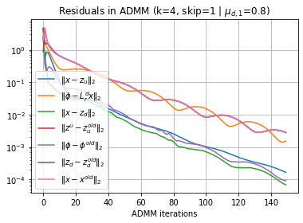
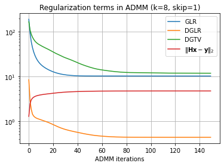
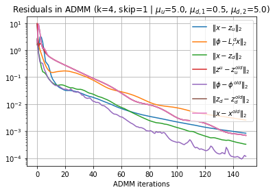
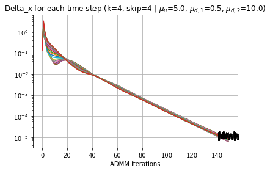

# Discussion 0319

## 1 Directed temporal graph with skip-connection

### 1.1 Mathematics


Define the effects of time step $i$ on time $j$ is **global and uniform**: $a_{j-i}$, max connection interval $t_0$

**Example**: $t_0=2$, adjacency matrix $\mathbf{W}^d(t_0=2)=\begin{bmatrix}0\\a_1 & 0\\a_2 &a_1&0\\ &a_2 & a_1 & 0\\& & \ddots&\ddots&\ddots \\ & & & a_2 & a_1& 0\end{bmatrix}$

### 1.2 Implementation

#### 1.2.1 Edge weights and Connection list

- Edge weights: All 1, normalized

  Matrix `(N, T, t_0)`

  Define the connection of station $i$: $\mathbf{W}_i\in\mathbb{R}^{T\times t_0}$:
  $$
  \mathbf{W}_i =\begin{bmatrix} *\\
  w_{1,0} & *\\
  w_{2,1} & w_{2,0} & *\\
  \vdots &\vdots & \ddots &\ddots \\
  w_{t_0-1, t_0-2} & w_{t_0-1, t_0-3} &\cdots & w_{t_0-1,0} & *\\
  w_{t_0, t_0-1} & w_{t_0, t_0-2} &\cdots & w_{t_0,1} & w_{t_0, 0}\\
  \vdots &\vdots &\ddots & \vdots &\vdots\\
  w_{T-1, T-2} & w_{T-1, T-3} & \cdots & w_{T-1, T-t_0} &w_{T-1, T-t_0-1}
   \end{bmatrix} 
  $$

  where $w_{jk}$ denotes the weights of edge $i_{(t=k)} \rightarrow i_{(t=j)}$

  > Explanations: column $k$ in dimension -1 denotes the connections to its $k$-hop history

  In the form of a lower-triangle matrix with diagonals all 0

  normalized with row-sum equal to 1

- Connection list: Matrix `(T, t_0)`

  in the form 
    $$
  \mathbf{M} =\begin{bmatrix} *\\
  0 & *\\
  1 & 0 & *\\
  \vdots &\vdots & \ddots &\ddots \\
  t_0-2 & t_0-3 &\cdots & 0 & *\\
  t_0-1 & t_0-2 &\cdots & 1 & 0\\
  \vdots &\vdots &\ddots & \vdots &\vdots\\
  T-2 & T-3 & \cdots & T-t_0 &T-t_0-1
   \end{bmatrix} 
  $$

  $M_{ij}$ denotes nodes in time $i$'s $j$-hop **history**, which is time $i-j$.

  We generate this connection list using
  $$
  \begin{bmatrix}0\\1\\\vdots\\T-1\end{bmatrix}\mathbf{1}_{t_0}^\top -\mathbf{1}_T\begin{bmatrix} 1&2&\cdots&t_0\end{bmatrix} \in\mathbb{R}^{T\times t_0}
  $$

#### 1.2.2 Operations

`x (B, T, N, C), d_ew (T, t_0, N), time_list (T, t_0)`

- `apply_op_Ldr` ($\mathbf{L}^d_r\mathbf{x}$): $x_i - \sum_{j} w_{ij} x_j$

  - aggregation of features: multiply each element in $\mathbf{W}$ with $\mathbf{x}$ according to each index in $\mathbf{M}$, then sum up each row

- `apply_op_LdrT` ($(\mathbf{L}^d_r)^\top \mathbf{x}$): $x_j - \sum_{i} w_{ij} x_i$

  - aggregation of features: element-wise mutiply each column in $\mathbf{W}$ with $\mathbf{x}$, then sum up each diagonals from `offset={-1, ..., -T+1}`

detailed implementation in `directed_graph.ipynb`

#### 1.2.3 Undirected version
save in 

## 2 Setup

### 2.1 Normalization of node signals

- ~~Standardization~~ (mean=0, std=1):
  $$
  \hat{x}=\frac{x-\text{mean}(\bold{x})}{\text{std}(\bold x)}
  $$
- √ **Normalization** (in [0, 1])
  $$
  \hat{x}=\frac{x-\min(\bold{x})}{\max(\bold x)-\min(\bold x)}
  $$

Perform normalization on each station (*i.e.*, each sequence).

**Data Disparity**: compute *distribution metrics* (*e.g.*,standard error (`std`), interquartile range (`iqr`)) for $N$ stations (on the whole sequence) $\sigma_1,\dots, \sigma_N$
- **Coefficient Variation (CV)**: $\text{CV} = {\text{std}(\sigma_1, \dots, \sigma_N)}/{\text{mean}(\sigma_1,\dots, \sigma_N)}$
- **Variance**: $\text{Var}=\text{Var}(\sigma_1, \dots, \sigma_N)$
- **Peak-to-peak**: $\text{PtP}=\max \sigma_i - \min \sigma_i$

**Example**: PEMS04 Dataset
Before normalization:
```
[Metric=std] Disparity of each station: CV: 0.3896, Var: 2198.0579, PtP: 221.3260
[Metric=iqr] Disparity of each station: CV: 0.4059, Var: 7313.3750, PtP: 436.0000
```

After Normalization:
```
[metric=std] coefficient of variation: 0.1536, variance: 0.0014, peak-to-peak: 0.2085
[metric=iqr] coefficient of variation: 0.2271, variance: 0.0093, peak-to-peak: 0.5112
```

### 2.2 Design
**A. Experiment design (150 iterations)**
1. Plot the residuals:
    - Primal residuals:
    - Dual residuals:
2. Plot convergence curve of each time step $\Vert x_t - x_t^{\text{old}}\Vert_2$
3. Plot each term of interest:
    - reconstruction error ($\Vert \mathbf{y} - \mathbf{Hx}\Vert_2$)
    - GLR ($\mathbf{x}^\top \mathbf{L}^u \mathbf{x}$)
    - DGLR ($\mathbf{x}^\top \mathcal{L}^d_r \mathbf{x}$)
    - DGTV ($\Vert \mathbf{L}^d_r \mathbf{x}\Vert_1$)

**B. Graph Design:**
- directed graph:
  - line graph: `0 -> 1 -> 2 -> ... -> T-1`: *Normalized graph weights are all 1*
  - kNN graph: $v_j^t\rightarrow v_i^{t+1}$ if $v_j$ is a $k$-NN of $v_i$
  - line graph with skip connection: discussed in Sec. 1, *set all weights equal, then normalize*
- undirected graph: kNN graph

**C. Grid search of each parameters:**
- For line graph: 
  - ADMM parameters $\mu_u, \mu_{d,1}, \mu_{d,2}$
  - $k, \sigma_u$ for undirected graph ($w_{ij} = \exp(-d_{ij}/\sigma_u)$)
- For kNN directed graph: check the difference
- For line graph with skip-connection: maximum interval

**D. Settings:**
- Normalized PEMS04
- Input $x[0:12]$, predict $x[0:23]$
- Defaults: $k=4$, $\sigma_u=50$, $\rho=8, \rho_u=4,\rho_d=4$

## 3 Experiments
### 3.1 Line Graph (max interval = 1, k = 0)

#### ADMM parameters

$\mu_{d,1} \in \{0.1,0.2,0.5,0.8,1\}$, $\mu_u=1, \mu_{d,2}=1$: (conclusions)

<div style="display: flex; justify-content: space-between;">
  
  
  
</div>

<div style="display: flex; justify-content: space-between;">
  
  
  
</div>

<div style="display: flex; justify-content: space-between;">
  
  
  
</div>

<div style="display: flex; justify-content: space-between;">
  
  
  
</div>

<div style="display: flex; justify-content: space-between;">
  
  
  
</div>

$\mu_{d,2} \in \{0.2,0.5,1, 2, 5, 10\}$, $\mu_{d,1}=0.5, \mu_u=1$
<div style="display: flex; justify-content: space-between;">
  
  
  
</div>

<div style="display: flex; justify-content: space-between;">
  
  
  
</div>

<div style="display: flex; justify-content: space-between;">
  
  
  
</div>

<div style="display: flex; justify-content: space-between;">
  
  
  
</div>

<div style="display: flex; justify-content: space-between;">
  
  
  
</div>

$\mu_{u} \in \{0.2,0.5,1, 2, 5, 10\}$, $\mu_{d,1}=0.5, \mu_{d,2}=10$
<div style="display: flex; justify-content: space-between;">
  
  
  
</div>

<div style="display: flex; justify-content: space-between;">
  
  
  
</div>

<div style="display: flex; justify-content: space-between;">
  
  
  
</div>

<div style="display: flex; justify-content: space-between;">
  
  
  
</div>

<div style="display: flex; justify-content: space-between;">
  
  
  
</div>

#### Undirected Graph parameters

$k\in\{2,4,6,8\}$, $\mu_{d,1}=0.5, \mu_{d,2}=1,\mu_u=1$: no significant influence

<div style="display: flex; justify-content: space-between;">
  
  
  
</div>

<div style="display: flex; justify-content: space-between;">
  
  
  
</div>

<div style="display: flex; justify-content: space-between;">
  
  
  
</div>

<div style="display: flex; justify-content: space-between;">
  
  
  
</div>


$\sigma_u\in\{20, 50, 100, 200\}$: no significant influence

<div style="display: flex; justify-content: space-between;">
  
  
  
</div>

<div style="display: flex; justify-content: space-between;">
  
  
  
</div>

<div style="display: flex; justify-content: space-between;">
  
  
  
</div>

<div style="display: flex; justify-content: space-between;">
  
  
  
</div>

#### Best parameters
$\mu_u=5,\mu_{d,1}=0.5,\mu_{d,2}=5$
<div style="display: flex; justify-content: space-between;">
  
  
  
</div>

$\mu_u=5,\mu_{d,1}=0.5,\mu_{d,2}=5$

<div style="display: flex; justify-content: space-between;">
  
  
  
</div>


**Conclusion:**
- best optimized: DGLR. $\mu_{d,2}$ could be much smaller than other $\mu$
- worst optimized: DGTV. Increasing $\mu_{d,1}$ doesn't improve the convergence.

Need more complex directed graph. Complexity: in spatial (kNN) or temporal (skip connection)

### 3.2 Directed kNN Graph (max interval = 1, k = 4)

No difference with line graph. *skip-connection matters*

### 3.3 Skip-connection directed graphs

max intervals in [1,2,3,4,5,6]: larger interval increases the convergence speed

<div style="display: flex; justify-content: space-between;">
  
  
  
</div>

<div style="display: flex; justify-content: space-between;">
  
  
  
</div>
<div style="display: flex; justify-content: space-between;">
  
  
  
</div>

<div style="display: flex; justify-content: space-between;">
  
  
  
</div>

<div style="display: flex; justify-content: space-between;">
  
  
  
</div>

<div style="display: flex; justify-content: space-between;">
  
  
  
</div>

$k=4$ may be a good point.

## 4 Discussion 

- Implementation in Unrolling: 
  - computing attention for skip connections / assign learnable parameters? 
  - complexity in computation
  - number of layers, number of blocks
- Data structure: suming diagonals involve loops---not efficient
- Implementation of Undirected Temporal Graph with skip connections


